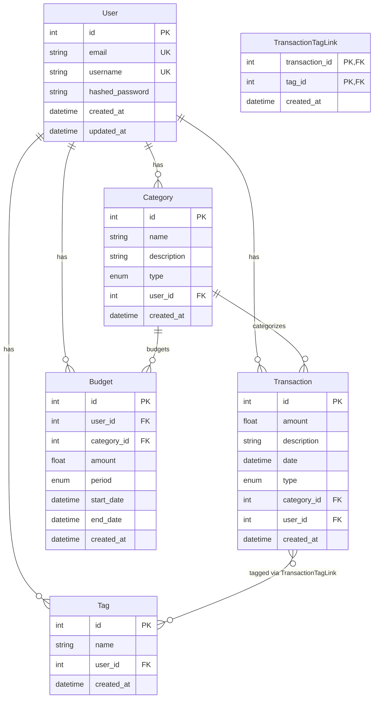

# Модель данных

## ER-диаграмма



## Описание моделей

### User

Пользователь системы. Имеет уникальные `email` и `username`.

| Поле | Тип | Описание |
|------|-----|----------|
| `id` | int | Первичный ключ |
| `email` | str | Уникальный email |
| `username` | str | Уникальное имя пользователя |
| `hashed_password` | str | Хеш пароля (bcrypt) |
| `created_at` | datetime | Дата создания |
| `updated_at` | datetime | Дата обновления |

### Category

Категория доходов или расходов. Принадлежит пользователю.

| Поле | Тип | Описание |
|------|-----|----------|
| `id` | int | Первичный ключ |
| `name` | str | Название категории |
| `description` | str? | Описание |
| `type` | TransactionType | `income` или `expense` |
| `user_id` | int? | Владелец (FK → User) |
| `created_at` | datetime | Дата создания |

### Transaction

Финансовая транзакция. Связана с категорией и пользователем, может иметь теги.

| Поле | Тип | Описание |
|------|-----|----------|
| `id` | int | Первичный ключ |
| `amount` | float | Сумма |
| `description` | str? | Описание |
| `date` | datetime | Дата транзакции |
| `type` | TransactionType | `income` или `expense` |
| `category_id` | int | Категория (FK → Category) |
| `user_id` | int | Владелец (FK → User) |
| `created_at` | datetime | Дата создания |

### Budget

Бюджет на период. Связан с пользователем и (опционально) категорией.

| Поле | Тип | Описание |
|------|-----|----------|
| `id` | int | Первичный ключ |
| `user_id` | int | Владелец (FK → User) |
| `category_id` | int? | Категория (FK → Category) |
| `amount` | float | Сумма бюджета |
| `period` | BudgetPeriod | `monthly`, `weekly`, `yearly` |
| `start_date` | datetime | Начало периода |
| `end_date` | datetime? | Конец периода |
| `created_at` | datetime | Дата создания |

### Tag

Тег для группировки транзакций. Уникален в рамках пользователя (composite unique: `name` + `user_id`).

| Поле | Тип | Описание |
|------|-----|----------|
| `id` | int | Первичный ключ |
| `name` | str | Название тега |
| `user_id` | int? | Владелец (FK → User) |
| `created_at` | datetime | Дата создания |

### TransactionTagLink

Связующая таблица для many-to-many между Transaction и Tag.

| Поле | Тип | Описание |
|------|-----|----------|
| `transaction_id` | int | FK → Transaction (PK) |
| `tag_id` | int | FK → Tag (PK) |
| `created_at` | datetime | Дата создания связи |

## Перечисления (Enums)

```python
class TransactionType(str, Enum):
    INCOME = "income"
    EXPENSE = "expense"

class BudgetPeriod(str, Enum):
    MONTHLY = "monthly"
    WEEKLY = "weekly"
    YEARLY = "yearly"
```

## Связи

| Связь | Тип | Описание |
|-------|-----|----------|
| User → Category | one-to-many | Пользователь имеет много категорий |
| User → Transaction | one-to-many | Пользователь имеет много транзакций |
| User → Budget | one-to-many | Пользователь имеет много бюджетов |
| User → Tag | one-to-many | Пользователь имеет много тегов |
| Category → Transaction | one-to-many | Категория содержит транзакции |
| Category → Budget | one-to-many | Категория имеет бюджеты |
| Transaction ↔ Tag | **many-to-many** | Транзакция может иметь много тегов, тег — много транзакций (через `TransactionTagLink`) |
