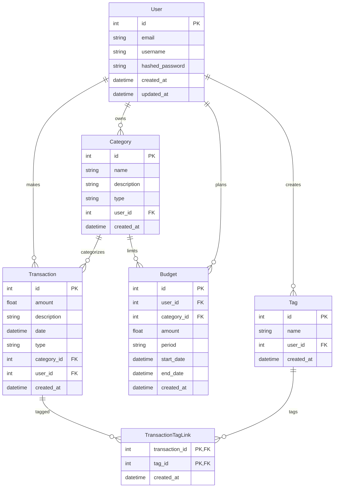

# Lab 1 Implementation Plan: Personal Finance Management API

## Project Overview
Build a FastAPI-based personal finance management system with user authentication, transaction tracking, budgeting, and reporting features.

## Technology Stack
- **Backend Framework**: FastAPI
- **ORM**: SQLModel (SQLAlchemy + Pydantic)
- **Database**: PostgreSQL (SQLite for development)
- **Migration Tool**: Alembic
- **Authentication**: JWT (JSON Web Tokens) with manual implementation
- **Environment Management**: python-dotenv
- **Testing**: pytest, httpx
- **Documentation**: Auto-generated Swagger UI (FastAPI)

## Database Schema

### Entities

#### User
- `id` (Integer, Primary Key)
- `email` (String, Unique)
- `username` (String, Unique)
- `hashed_password` (String)
- `created_at` (DateTime)
- `updated_at` (DateTime)

#### Category
- `id` (Integer, Primary Key)
- `name` (String)
- `description` (String, Optional)
- `type` (Enum: `income` or `expense`)
- `user_id` (Integer, Foreign Key to User, Optional) – user-specific categories; if NULL, system default category
- `created_at` (DateTime)

#### Transaction
- `id` (Integer, Primary Key)
- `amount` (Float)
- `description` (String, Optional)
- `date` (DateTime)
- `type` (Enum: `income` or `expense`)
- `category_id` (Integer, Foreign Key to Category)
- `user_id` (Integer, Foreign Key to User)
- `created_at` (DateTime)

#### Budget
- `id` (Integer, Primary Key)
- `user_id` (Integer, Foreign Key to User)
- `category_id` (Integer, Foreign Key to Category, Optional) – if NULL, overall budget
- `amount` (Float) – planned budget amount
- `period` (Enum: `monthly`, `weekly`, `yearly`)
- `start_date` (DateTime)
- `end_date` (DateTime, Optional)
- `created_at` (DateTime)

#### Tag
- `id` (Integer, Primary Key)
- `name` (String, Unique)
- `user_id` (Integer, Foreign Key to User, Optional) – user-specific tags; if NULL, system default tag
- `created_at` (DateTime)

#### TransactionTagLink
- `transaction_id` (Integer, Foreign Key to Transaction, Primary Key)
- `tag_id` (Integer, Foreign Key to Tag, Primary Key)
- `created_at` (DateTime)

### Relationships
- User **1 → N** Transaction
- User **1 → N** Category (optional)
- User **1 → N** Budget
- User **1 → N** Tag (optional)
- Category **1 → N** Transaction
- Category **1 → N** Budget (optional)
- Transaction **N ↔ N** Tag (via TransactionTagLink)

### ER Diagram (Mermaid)


## API Endpoints

### Authentication
- `POST /auth/register` – register new user (email, username, password)
- `POST /auth/login` – login, returns JWT token
- `POST /auth/refresh` – refresh JWT token (optional)
- `POST /auth/logout` – invalidate token (optional)

### Categories
- `GET /categories` – list categories (system defaults + user’s own)
- `POST /categories` – create new user-specific category
- `GET /categories/{id}` – get category details
- `PATCH /categories/{id}` – update category
- `DELETE /categories/{id}` – delete category (if no transactions attached)

### Transactions
- `GET /transactions` – list transactions with filtering (date range, category, type)
- `POST /transactions` – create a new transaction
- `GET /transactions/{id}` – get transaction details
- `PATCH /transactions/{id}` – update transaction
- `DELETE /transactions/{id}` – delete transaction

### Budgets
- `GET /budgets` – list user’s budgets
- `POST /budgets` – create a new budget
- `GET /budgets/{id}` – get budget details
- `PATCH /budgets/{id}` – update budget
- `DELETE /budgets/{id}` – delete budget

### Reports
- `GET /reports/summary` – monthly income/expense summary
- `GET /reports/category-breakdown` – spending by category
- `GET /reports/budget-vs-actual` – compare budgeted vs actual spending

## Authentication Implementation Details
- Password hashing using `bcrypt` (allowed per lab note)
- JWT token generation using `python-jose[cryptography]`
- Manual token validation (no third‑party auth libraries)
- Protected endpoints require `Authorization: Bearer <token>`
- Token expiry: 30 minutes, refresh token optional

## Project Structure
```
Lr1/
├── app/
│   ├── __init__.py
│   ├── main.py                 # FastAPI app instance
│   ├── models.py              # SQLModel models
│   ├── schemas.py             # Pydantic schemas for requests/responses
│   ├── crud.py                # CRUD operations
│   ├── auth.py                # authentication logic
│   ├── database.py            # database connection & session
│   ├── dependencies.py        # FastAPI dependencies (current user, etc.)
│   └── routers/
│       ├── __init__.py
│       ├── auth.py
│       ├── categories.py
│       ├── transactions.py
│       ├── budgets.py
│       └── reports.py
├── migrations/                # Alembic migrations
├── tests/
│   ├── __init__.py
│   ├── conftest.py
│   ├── test_auth.py
│   └── ...
├── .env.example
├── .gitignore
├── alembic.ini
├── requirements.txt
├── README.md
└── plan.md (this file)
```

## Development Steps
1. **Environment Setup**
   - Create virtual environment (`python -m venv venv`)
   - Install dependencies from `requirements.txt`
   - Set up `.env` file with database URL and secret key

2. **Database Configuration**
   - Create `database.py` with SQLModel engine and session
   - Implement `get_session` dependency

3. **Model Definition**
   - Define SQLModel classes for User, Category, Transaction, Budget
   - Set up relationships and constraints

4. **Authentication Module**
   - Implement password hashing and verification
   - Implement JWT token creation/validation
   - Create auth endpoints (register, login)

5. **CRUD Endpoints**
   - Implement each router with full CRUD operations
   - Add request/response models with proper validation

6. **Business Logic**
   - Budget vs actual calculations
   - Reporting aggregations

7. **Migrations**
   - Initialize Alembic (`alembic init migrations`)
   - Configure `env.py` to use SQLModel metadata
   - Generate and apply initial migration

8. **Testing**
   - Write unit tests for models and CRUD
   - Write integration tests for API endpoints

9. **Documentation**
   - Update README with installation and usage
   - Ensure auto‑generated Swagger docs are complete

10. **Finalization**
    - Run full test suite
    - Create final report with code snippets and API examples

## Dependencies (requirements.txt)
```
fastapi==0.104.1
sqlmodel==0.0.14
alembic==1.12.1
psycopg2-binary==2.9.9
python-dotenv==1.0.0
python-jose[cryptography]==3.3.0
bcrypt==4.1.2
httpx==0.25.1
pytest==7.4.3
pytest-asyncio==0.21.1
uvicorn[standard]==0.24.0
```

## Success Criteria
- All endpoints work as described
- Authentication protects private endpoints
- Database relationships are correctly implemented
- Migrations can be applied from scratch
- Unit tests pass
- Report endpoints return correct aggregated data
- Code follows PEP 8 and best practices

## Notes
- Lab requires manual implementation of authentication (no third‑party libraries except for hashing/JWT).
- Use PostgreSQL for production‑like environment; SQLite allowed for development.
- Alembic must be used for migrations; manual SQL scripts not acceptable.
- Final report must include all implemented endpoints, models, and connection code.
- The report must be provided in GitHub Pages format (mkdocs) as per course requirements.